------------------------------------------------------------------------------------------------------
<h1>Definição</h1>

Grafos  
	- É um modelo matemático que representa relações entre objetos 
	- Utilizados na definição e/ou resolução de problemas de diversas áreas 

Em computação 
	- É uma forma de solucionar problemas computáveis. 
	- Buscam o desenvolvimento de algoritmos mais eficientes. 

Exemplos 
	- Qual a melhor rota da minha casa até um restaurante? 
	- Duas pessoas tem algum amigo em comum? 

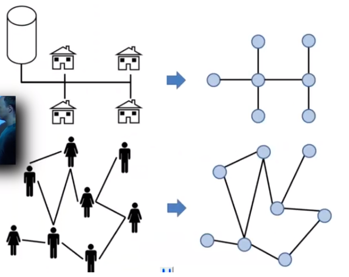

Grafos 
	- É definido como um conjunto de vértices e um conjunto de areastas que conectam qualquer par de vértices. 
	- G = (V, A) 
		- V é o conjunto de vértices (não vazio) 
		- A é o conjunto de arestas 

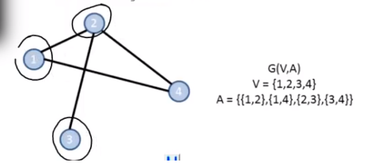

Vértice 
	- É cada uma das entidades representadas em um grafo. 
	- Depende da natureza do problema. Podem ser pessoas, casa, etc. 
	- Dois vértices são ADJACENTES se existir uma aresta ligando eles. 

Aresta 
	- Tambéms chamada de ARCO 
	- Está associada a dois vértices (v1, v2) 
	- Faz a ligação entre eles, ou seja, diz qual a relação entre eles 

-----------------------------------------------------------------------------------------------
<h1>Propriedades</h1>

Direção das Arestas 
Grafo direcionado ou Digrafo 
	- Existe uma orientação quanto ao sentido das arestas. 
	- Se uma aresta liga A e B, podemos ir de A para B, mas não o contrário. 

Grafo não direcionado 
	- Não existe nenhuma orientação quanto ao sentido da aresta. Podemos ir de A para B ou de B para A. 

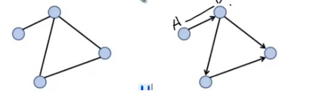

Grau de um vértice 
	- É o número de arestas que chegam ou partem dele 
	- No caso dos digrafos, temos: 
		- Grau de Entrada: Arestas que chegam ao vértice 
		- Grau de Saída: Arestas que partem do vértice 

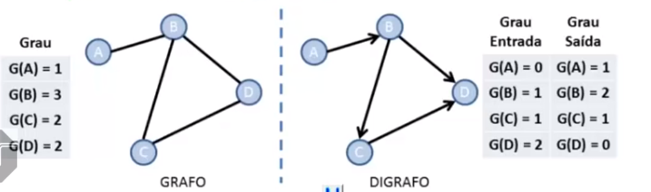

Laço 
	- Uma aresta é chamada de laço se seu vértice de partida é o mesmo que o de chegada, ou seja, a aresta conecta o vértice com ele mesmo (v,v). 

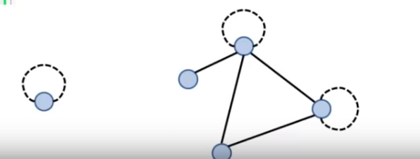

Caminho 
	- É uma sequência de vértices de modo que existe sempre uma aresta ligando o vértice anterior com o seguinte 

Caminho Simples 
	- Nenhum dos vértices no caminho se repete 

Comprimento do caminho 
	- É o número de arestas que o caminho usa 

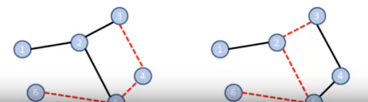

Ciclo 
	- É um caminho que começa e termina no mesmo vértice. 
	- Um laço é um ciclo de comprimento 1 

Grafo acíclico 
	- Não contém ciclos simples (onde cada vértice aparece apenas uma vez cada). 

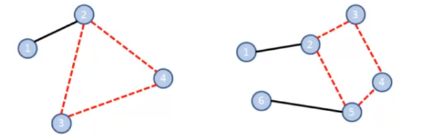

Arestas Múltiplas
	- Também chamado Multigrafo
	- É um grafo que permite mais de uma aresta conectando o mesmo par de vértices
	- Neste caso, as arestas são ditas paralelas

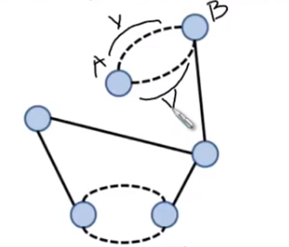

-------------------------------------------------------------------------------------------------
<h1>Tipos de Grafos</h1>

Grafo Trivial
	- É um grafo com um único vértice e sem arestas

Grafo Simples
	- É um grafo não direcionado, sem laços e sem arestas paralelas.

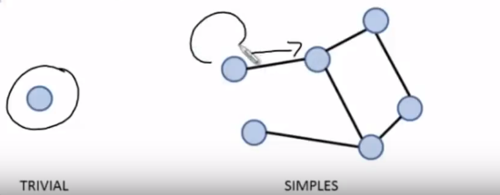

Grafo Completo  
	- É um grafo simples onde cada vértice se conecta a todos os outros vértices 

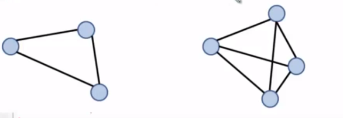

Grafo Regular 
	- É um grafo onde todos os vértices possuem o mesmo grau 

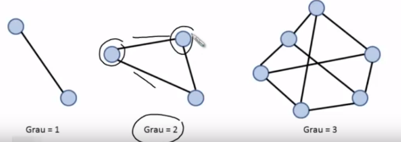

Subgrafo 
	- Um grafo Gs(Vs, As) é chamado de subgrafo de G(V, A) se: 
		- VS está contido em V 
		- As está contido em A 

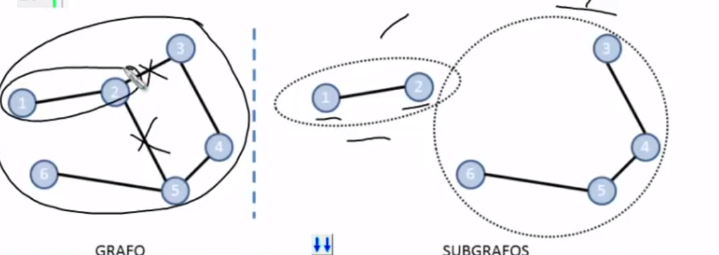

Grafo Bipartido 
	- É um grafo cujos vértices podem ser divididos em dois conjuntos. 
	- Nesse caso, as arestas ligam os vértices que estão em conjuntos diferentes, nunca ligando vértices do mesmo conjunto. 

Grafo Conexo 
	- Existe um caminho partindo de qualquer vértice até qualquer outro vértice do grafo. 

Grafo Desconexo 
	- Não existe um caminho ligando dois vértices selecionados. 

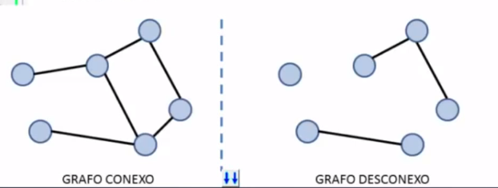

Grafos Isomorfos 
	- Dois grafos, G1(V1, A1) e G2(V2, A2), são ditos isomorfos se existe uma função que faça o mapeamento de vértices e arestas de modo que os dois grafos se tornem coincidentes. 

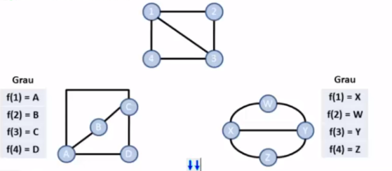

Grafo Ponderado 
	- É o grafo que possui pesos associados a cada uma de suas arestas. 

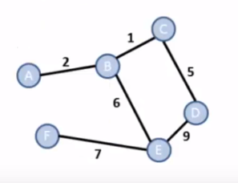

Grafo Hamiltoniano 
	- É o grafo que possui um caminho que visita cada vértice apenas umas vez. 
		- Sua detecção é uma tarefa extremamente árdua. 

	- Um ciclo hamiltoniano é o clico que visita cada vértice apenas uma vez. 

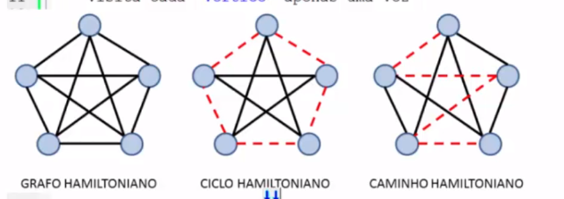

Grafo Euleriano 
	- É o grafo que possui um ciclo que visita cada aresta apenas uma vez. 

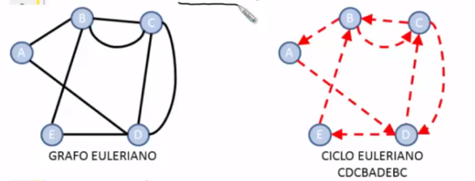

Grafo Semi-Euleriano 
	- É o grafo que possui um caminho que visita cada aresta apenas uma vez. 

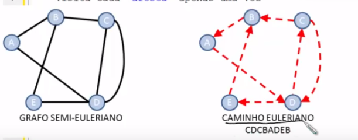
