------------------------------------------------------------------------------------------------------
<h1>Ordenação</h1>
	- É a tarefa de colocar um conjunto de dados em uma determinada ordem 
	- Permite acesso mais eficiente aos dados 

Algoritmo de ordenação 
	- É o algoritmo que coloca os elementos de uma dada sequência em uma certa ordem. 

	Exemplo: 
	5, 2, 1, 3, 4 -> FORA DE ORDEM 
	1, 2, 3, 4, 5 -> ORDENADO 

Tipos de ordenação mais comuns 
	- Numérica 
		1, 2, 3, 4, 5 
	- Lexicográfica (ordem alfabética) 
		Ana, André, Bianca, Ricardo 
 
Independente do tipo, ela pode ser 
	- Crescente 
		1, 2, 3, 4 
		Ana, André, Bianca, Ricardo 
 
	- Decrescente 
		5, 4, 3, 2, 1  
		Ricardo, Bianca, André, Ana 

Classificação dos métodos de ordenação 
	- Ordenação Interna 
		- O arquivo a ser ordenado cabe todo na memória principal 
		- Qualquer registro pode ser imediatamente acessado 
	
	- Ordenação externa 
		- O arquivo a ser ordenado não cabe na memória principal 
		- Os registros são acessados sequencialmente ou em grandes blocos 

Métodos de ordenação estudados 
	- Básicos O(n^2) geralmente 
		- Fácil implementação 
		- Auxiliam o entendimento dos algoritmos complexos 
	 
	- Sofisticados O(n log n) 
		- Em geral, melhor desempenho. 
 
------------------------------------------------------------------------------------------------------
<h1>BubbleSort ou Ordenação por Bolha</h1>

Compara pares de elementos adjacentes e os troca de lugar se estiver na ordem errada 
Esse processo se repete até que mais nenhuma troca seja necessária (elementos já ordenados) 

Performance 
	- Melhor Caso: O(n) 
	- Pior Caso: O(n^2) 
	- Não recomendado para grandes conjuntos de dados 
 
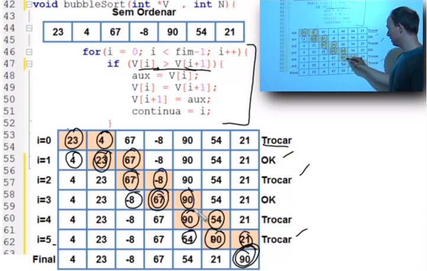 

------------------------------------------------------------------------------------------------------
<h1>InsertionSort ou Ordenação por Inserção</h1>
Similar a ordenação de cartas de baralho com as mãos 
Pega-se uma carta de cada vez e a coloca em seu devido lugar, sempre deixando as cartas da mão em ordem 

Perfomance 
	- Melhor Caso: O(N) 
	- Pior Caso: O(N^2) 
	- Eficiente para conjuntos pequenos de dados 
	- Estável: Não altera a ordem de dados iguais 
	- Capaz de ordenar os dados a medida em que os recebe (tempo real) 

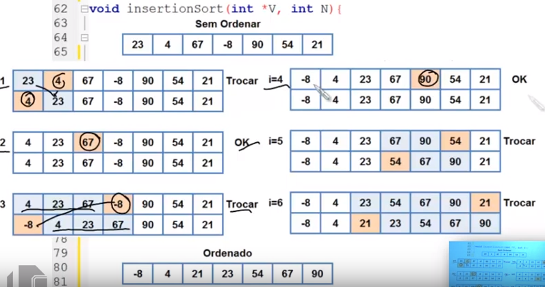

------------------------------------------------------------------------------------------------------
<h1>SelectionSort ou Ordenação por Seleção</h1>

A cada passo, procura o menor valor do array e o coloca na primeira posição do array 
Descarta-se a primeira posição do array e repete-se o processo para a segunda posição 
Isso é feito para todas as posições do array 

Performance 
	- Melhor Caso: O(N^2) 
	- Pior Caso: O(N^2) 
	- Ineficiente para grandes conjuntos de dados 
	- Não é estável, pode ser estável com algumas modificações: não altera a ordem de dados iguais 

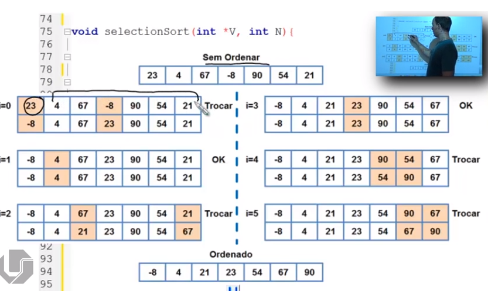

------------------------------------------------------------------------------------------------------
<h1>MergeSort ou Ordenação por Mistura</h1>

Ideia básica: Dividir e Conquistar 
Divide, recursivamente, o conjunto de dados até que cada subconjunto possua 1 elemento 
Combina 2 subconjuntos de forma a obter 1 conjunto maior e ordenado 
Esse processo se repete até que exista apenas 1 conjunto 

Performance 
	- Melhor Caso: O(N log N) 
	- Pior Caso: O(N log N) 
	- Estável: Não altera a ordem de dados iguais 
	- Desvantagem: Recursivo e usa um veotr auxiliar durante a ordenação 

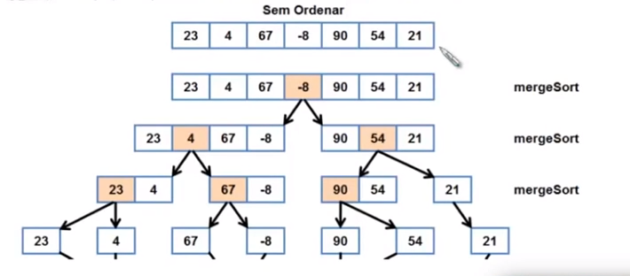
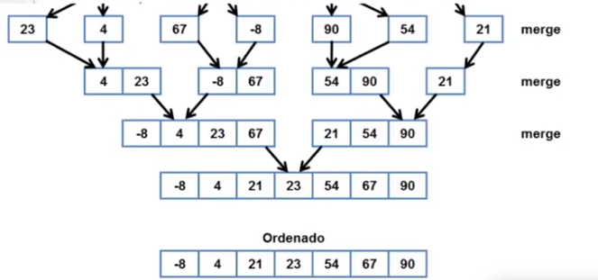
------------------------------------------------------------------------------------------------------
<h1>QuickSort ou Ordenação por Troca de Partições</h1>

Ideia básica: Dividir e Consquistar. 
Um elemento é escolhido como pivô. 
Particionar: Os dados são rearranjados (valores menores do que o pivô são colocados antes dele e os maiores, depois). 
Recursivamente ordena as 2 partições. 

Performance 
	- Melhor Caso: O(N log N) 
	- Pior Caso (raro): O(N^2) 
	- Não Estável, mas pode ser com algumas modificações: Não altera a ordem de dados iguais 
	- Desvantagens: Como escolher o pivô? 

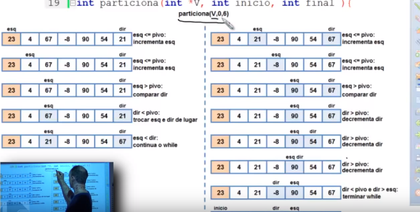
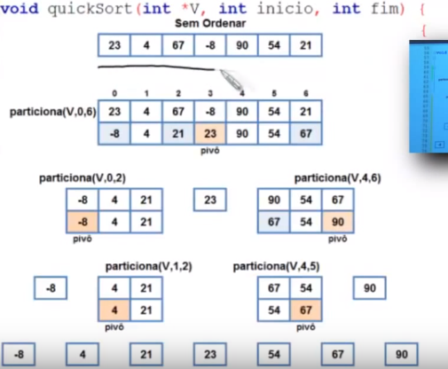
--------------------------------------------------------------------------------------------------------
<h1>HeapSort ou Ordenação usando heap</h1>
Heap: Vetor que simula uma arvore binária completa (exceção do último nível) 
Todo elemento pai do vetor possui dois elementos como filhos 
pai (i) -> filhos: (2*i+1) e (2*i+2) 

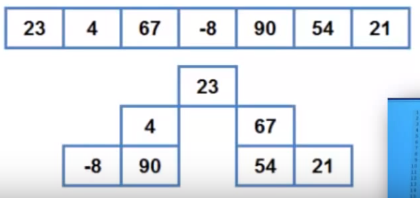
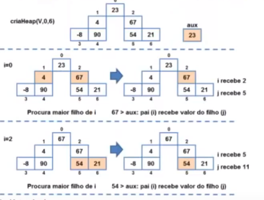
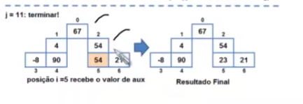
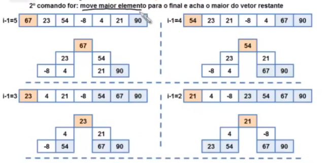
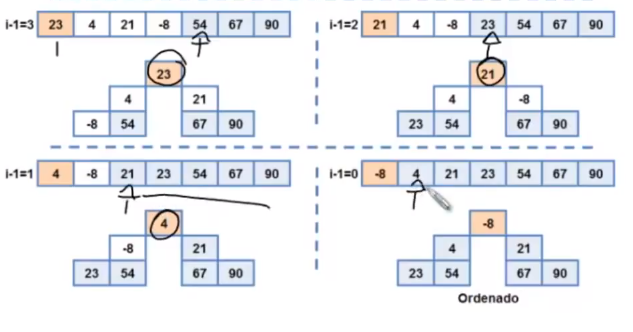

----------------------------------------------------------------------------------------------------------
<h1>Ordenação em Vetor de Struct</h1>

As vezes é necessário ordenar dados além de numéricos, como por exemplo, textos. 

---------------------------------------------------------------------------------------------------------
<h1>Usando a função qsort()</h1>

Quicksort 
	- Algoritmo rápido de ordenação 
	- Complexidade N log N 
	- Implementado na bibliboteca stdlib.h 

Protótipo 
	void qsort(void *base, size_t num, size_t size, int(*compar) (const void*, const void*)); 

Parâmetros 
	- Base: Endereço do array a ser ordenado 
	- Num: Tamanho do array 
	- size: tamanho, em bytes, de cada posição do array 
	- compar: ponteiro para a função de comparação 
	
	- size_t é apenas um inteiro sem sinal 

Função de comparação 
	- Função que define como dois valores (p1 e p2) do array serão ser comparados. 
	- Deve seguir o seguinte protótipo 

int compar (const void* p1, const void* p2); 

Retorno da função 
	- Valor menor do que 0: p1 vem antes de p2 
	- Valor igual a 0: p1 é igual a p2 
	- Valor maior do que 0: p1 vem depois de p2 

----------------------------------------------------------------------------------------------
<h1>Ordenação Externa</h1>

- Consiste em ordenar conjuntos de dados maiores do que a memória interna disponível. 
- Ordenação deve ser feita em arquivos.  
- Os algoritmos devem minizar o número de acesso às unidades de memórida externa. 

Diferença em relação a ordenação interna 
	- Custo de acesso a memória secundária é muito maior. 
	- Transferência de dados entre a memória interna e externa. 
	- Acesso sequencial aos dados (acesso direto é muito caro). 

MergeSort Externo 
	- Método mais importante de ordenação externa. 
	- Intercalação: Combina dois ou mais blocos ordenados em um único bloco, maior, ordenado. 
 
MergeSort Externo: Funcionamento
	- RAM comporta N registros de dados. 
	- Carregar parte do arquivo na RAM. 
	- Ordenar os dados na RAM com um algoritmo. 
	in-place (Ex: QuickSort)
	- Salvar os dados ordenados em um arquivo separado. 
	- Repetir os anteriores até terminar o arquivo original. 
	- Ao final, temos "K" arquivos ordenados. 
	- "Multi-Way Merging" 
		- Criar "K+1" buffers de tamanho "N/(K+1)" 
		- ("1" de saída, "K" de entrada) 
		- Carregar parte dos arquivos ordenados nos BUFFERS DE ENTRADA, intercalar no BUFFER DE SAÍDA. 
		- BUFFER DE ENTRADA vazio: Carregar mais dados. 
		- BUFFER DE SAÍDA cheio: Salvar Dados. 

		

