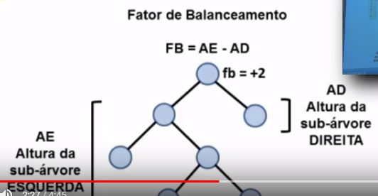
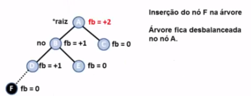
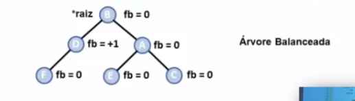

<h1>Definição</h1>
- É um tipo de árvore binária balanceada. 
- Criada por <strong>A</strong>delson-<strong>V</strong>elskii e <strong>L</strong>andis.
 
 
- Permite rebalanceamento local. 
- Apenas a parte afetada pela inserção ou remoção é rebalanceada. 
- Uso de rotações <strong>simples</strong> ou <strong>duplas</strong> na etapa de rebalanceamento. 

- A árvore AVL busca manter-se como uma árvore binária quase completa. 
- Custo de qualquer algoritmo é maximo O(logN). 

<h2>Fator de balanceamento ou fb</h2>
- Diferença nas alturas das sub-árvores esquerda e direita. 
- Se uma das sub-árvores não existir, sua altura será -1. 

-É usado no balanceamento da árvore. 
- Numa AVL, <strong>fb</strong> deve ser +1, 0 ou -1. 
- Se fb < -1 ou fb > +1: a árvore deve ser balanceada. 

