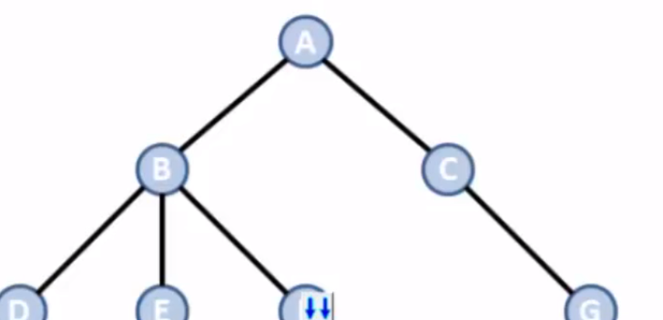
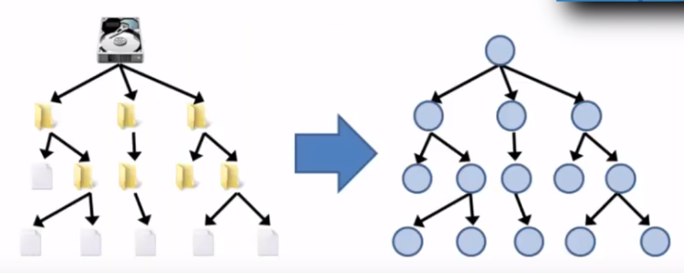
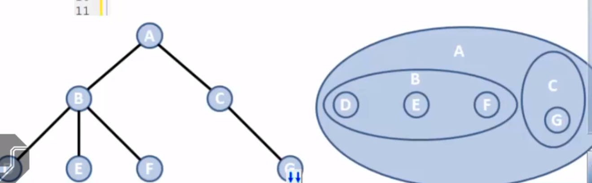

<h1>Árvores</h1>
- São um tipo especial de grafo.  
- Qualquer par de vértices esta coenctado a apenas uma aresta. 
- Grafo conexo (Existe exatamente um caminho entre quaisquer dois de seus vértices) e acíclico (não possui ciclos). 

<h2>Árvores</h2>
- Como são um tipo especial de "grafo", elas são definidas como um conjunto não vazio de "vértices" (ou "nós") e "arestas" que satisfazem os requisitos. 

<h2>Vértices</h2>
- É cada uma das entidades representadas na árvore (Depende da natureza do problema). 

<h2>Arestas</h2>
- É uma conexão entre dois "vértices". 

<h2>Aplicações</h2>
- Árvores são adequadas para representar estruturas hierárquicas não lineares. 

<h3>Exemplos</h3>
- Relações de descendência (pai, filho, etc). 
- Diagrama Hierárquico de uma organização.  
- Campeonatos de modalidades desportivas.  
- Taxonomia. 

<h3>Em computação</h3>
- Estrutura de Diretórios (Pastas). 
- Busca de Dados armazenados no computador.  
- Representação de espaço de soluções.  
(Ex: Jogo de Xadrez). 
- Modelagem de Algoritmos. 

<h1>Formas de Representação</h1>
- Grafo (Mais Comum). 
- Diagrama de Venn (Conjuntos Aninhados). 

- Existem vários tipos de árvores em computação, desenvolvidas para diferentes tipos de aplicação. 
- Árvore Binária de Busca.  
- Árvore AVL.  
- Árvore Rubro-Negra.  
- Árvore B+.  
- Árvore 2-3.  
- Árvore 2-3-4.  
- Quadtree.  
- Octree.  
- ETC.  

------------------------------------------------------------------------------------------------------
<h1>Propriedades</h1>