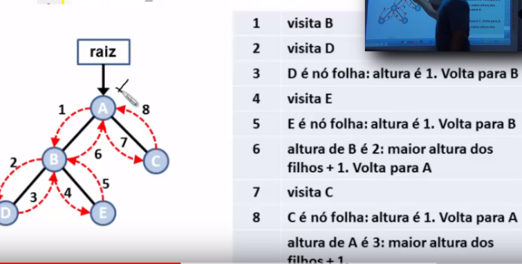
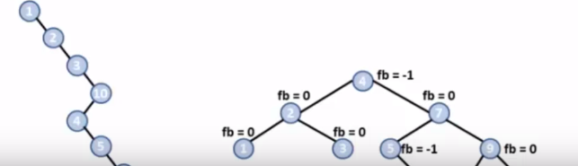

<h1>Árvores</h1>
- São um tipo especial de grafo.  
- Qualquer par de vértices esta coenctado a apenas uma aresta. 
- Grafo conexo (Existe exatamente um caminho entre quaisquer dois de seus vértices) e acíclico (não possui ciclos). 

<h2>Árvores</h2>
- Como são um tipo especial de "grafo", elas são definidas como um conjunto não vazio de "vértices" (ou "nós") e "arestas" que satisfazem os requisitos. 

<h2>Vértices</h2>
- É cada uma das entidades representadas na árvore (Depende da natureza do problema). 

<h2>Arestas</h2>
- É uma conexão entre dois "vértices". 

<h2>Aplicações</h2>
- Árvores são adequadas para representar estruturas hierárquicas não lineares. 

<h3>Exemplos</h3>
- Relações de descendência (pai, filho, etc). 
- Diagrama Hierárquico de uma organização.  
- Campeonatos de modalidades desportivas.  
- Taxonomia. 

<h3>Em computação</h3>
- Estrutura de Diretórios (Pastas). 
- Busca de Dados armazenados no computador.  
- Representação de espaço de soluções.  
(Ex: Jogo de Xadrez). 
- Modelagem de Algoritmos. 

<h1>Formas de Representação</h1>
- Grafo (Mais Comum). 
- Diagrama de Venn (Conjuntos Aninhados). 

- Existem vários tipos de árvores em computação, desenvolvidas para diferentes tipos de aplicação. 
- Árvore Binária de Busca.  
- Árvore AVL.  
- Árvore Rubro-Negra.  
- Árvore B+.  
- Árvore 2-3.  
- Árvore 2-3-4.  
- Quadtree.  
- Octree.  
- ETC.  

------------------------------------------------------------------------------------------------------
<h1>Propriedades</h1>
- Pai: é o antecessor imediato de um vértice. 
- Filho: É o sucessor imediato de um vértice. 
- Raiz: É o vértice que não possui pai. 
- Nós terminais ou folhas: Qualquer vértice que não possui filhos. 
- Nós não-terminais ou internos: Qualquer vértice que possui pelo menos 1 filho. 

 

<h2>Caminho em uma árvore</h2>
- É uma seuqência de vértices de modo que existe sempre uma aresta ligando o vértice anterior com o seguinte. 
- Existe exatamente um caminho entre a raiz e cada um dos nós da árvore. 

<h2>Sub-árvores</h2>
- Dado um determinado vértice, cada filho seu é a raiz de uma nova sub-árvore. 
- De fato, qualquer vértice é a raiz de uma sub-árvore consistindo dele e dos nós abaixo dele. 

<h2>Grau de um Vértice</h2>
- É o número de sub-árvores do vértice.

<h2>Altura da Árvore</h2>
- Também chamada de profundidade. 
- É o comprimento do caminho mais longo da raiz até uma das suas folhas. 

<h2>Níveis</h2>
- Numa árvore, os vértices são classificados em níveis. 
- O nível é o número de nós no caminho entre o vértice e a raiz. 

--------------------------------------------------------------------------------
<h1>Árvore Binária: Definição</h1>
- É um tipo especial de árvore. 
- Cada vértice pode possuir duas sub-árvore: sub-árvore esquerda e sub-árvore direita. 
- O grau de cada vértice (número de filhos) pode ser 0, 1 ou 2. 

<h2>Árvore Estritamente Binária</h2>
- Cada nó (vértice) possui 0 ou 2 sub-árvores. 
- Nenhum nó tem filho único. 
- Nós internos (não folhas) sempre tem 2 filhos. 

<h2>Árvore Binária Completa</h2>
- É ESTRITAMENTE BINÁRIA e todos os seus nós-folha estão no mesmo nível. 
- O número de nós de uma árvore binária completa é de 2^h-1, ounde h é a altura da árvore. 

<h2>Árvore Binária Quase Completa</h2>
- A diferença de altura entre as sub-árvores de qualquer nó é o máximo 1. 
- Se a altura da árvore é D, cada nó folha está no nível D ou D-1. 

-----------------------------------------------------------------------------------
<h1>Implementando uma Árvore Binária</h1>
Em uma Árvore Binária podemos realizar as seguintes operações: 
- Criação da Árvore. 
- Inserção de um elemento. 
- Remoção de um elemento.  
- Acesso a um elemento.  
- Destruição da Árvore. 
 
Essas operações dependem do tipo de alocação de memória usada: 
- Estática (Heap). 
- Dinâmica (Lista Encadeada). 

<h2>Alocação Estática (HEAP)</h2>
- Uso de um array.  
- Usa 2 funções para retornar a posição dos filhos à esquerda e à direita de um pai.  
FILHO_ESQ(PAI) = 2 * PAI + 1; 
FILHO_DIR(PAI) = 2 * PAI + 2;  

<h2>Alocação Dinâmica (Lista Encadeada)</h2>
- Cada nó da árvore é tratado como um ponteiro alocado dinamicamente a medida que os dados são inseridos.  

<h2>Implementando uma Árvore Binária com Alocação Dinâmica (Lista Encadeada)</h2>
- Para guardar o primeiro nó da árvore utilizamos um ponteiro para ponteiro.  
- Um ponteiro para ponteiro pode guardar o endereço de um ponteiro.  
- Assim, fica fácil mudar quem é a raiz da árvore (se necessário). 

 

Implementando uma Árvore Binária
ArvoreBinaria.h: Definir: 
- Os protótipos das funções.  
- O tipo de dado armazenado na árvore.  
- O ponteiro árvore. 

ArvoreBinaria.c: Definir: 
- O tipo de dado árvore. 
- Implementar as suas funções. 

--------------------------------------------------------------------------------------
<h1>Criando e Destruindo uma Árvore Binária</h1>
- Criação da árvore: Ato de criar a raiz da árvore. A raiz é um tipo de nó especial que aponta para o primeiro elemento da árvore. 
 
- Destruição da árvore: Envolve percorrer todos os nós da árvore de modo a liberar a memória alocada para cada um deles. 

-----------------------------------------------------------------------------------------
<h1>Algumas informações básicas sobre a árvore</h1>
- Está vazia?  
- Número de nós?  
- Altura da árvore?  

------------------------------------------------------------------------------------------
<h1>Percorrendo uma Árvore Binária</h1>
- Muitas operações em árvores binárias necessitam que se percorra todas os nós de suas sub-árvores, executando alguma ação ou tratamento em cada nó.  
 
- Cada nó é visitado uma única vez. 
- Isso gera uma sequência linear de nós, cuja ordem depende de como a árvore foi percorrida. 
 

- Podemos percorrer a árvore de 3 formas 
(Essas são as mais importantes, existem outras) 
<h2>Pré-Ordem</h2>
- Visita a raiz, o filho da esquerda e o filho da direita. 

<h2>Em-Ordem</h2>
- Visita o filho da esquerda, a raiz e o filho da direita. 

<h2>Pós-Ordem</h2>
- Visita o filho da esquerda, o filho da direita e a raiz. 

------------------------------------------------------------------------------------------------------------
<h1>Árvore Binária de Busca</h1>
- É um tipo de árvore binária onde cada nó possui um valor (chave) associado a ele, e esse valor determina a posição do nó na árvore. 
 
- Não existem valores repetidos. 

<h2>Posicionamento dos valores</h2>
- Para cada nó pai: 
- Todos os valores da sub-árvore esquerda são menores do que o nó pai. 
- Todos os valores da sub-árvore direita são maiores do que o nó pai.  
  
- A inserção e remoção de nós da árvore deve ser realizadas respeitando a propriedade da árvore.
 
Aplicações: 
- Busca Binária. 
- Análise de expressões algébricas: prefixa, infixa, e pósfixa. 
<h2>Principais Operações</h2>
Inserção: 
- Caso médio O(log n) 
- Pior caso O(n) (Árvore não balanceada). 
 
Remoção: 
- Caso Médio O(log n) 
- Pior caso O(n) (Árvore não balanceada). 
 
Consulta: 
- Caso médio O(log n). 
- Pior caso O(n) (Árvore não balanceada). 

-----------------------------------------------------------------------------------------
<h1>Inserção em Árvore Binária de Busca</h1>
Para inserir um valor V na árvore binária de busca: 
- Primeiro compare com a raiz. 
- V é menor do que a raiz: 
Vá para a sub-arvore esquerda.
 
 
- V é maior do que a raiz: 
Vá para a sub-árvore direita. 
 
- Aplique o método recursivamente (pode ser feito sem recursão). 
 
Támbem existe o caso onde a isnerção é feita em uma árvore binária que está vazia.

-----------------------------------------------------------------------------------------
<h1>Remoção em Árvore Binária de Busca</h1>
Existem 3 tipos de remoção:  
- nó folha (sem filhos) 
- nó com 1 filho  
- nó com 2 filhos  
 
 
Os 3 tipos de remoção trabalham juntos. A remoção sempre remove um elemento específico da árvore, o qual pode ser um nó folha, ter um ou dois filhos.
 
Cuidado: 
- Não se pode remover de uma árvore vazia. 
- Removendo o último nó, a árvore fica vazia. 

-------------------------------------------------------------------------------------
<h1>Consulta em Árvore Binária de Busca</h1>

Para pesquisar um valor V na árvore binária de busca:
- Primeiro compare com a raiz 
- V é menor do que a raiz: 
Vá para a sub-árvore esquerda
  
- V é maior do que a raiz: 
Vá para a sub-árvore direita. 
 
- Aplique o método recursivamente (pode ser feito sem recursão)  

--------------------------------------------------------------------------------------
<h1>Árvores Balanceadas</h1>
- É uma árvore binária onde as alturas das sub-árvores esquerda e direita de cada nó diferem de no máxima uma unidade. 
 
- Essa diferença é chamado de <strong>fator de balanceamento</strong> do nó.  

- A eficiência da busca em uma árvore binária depende do seu balanceamento. 
 
<h2>Problema</h2>
- Algoritmos de inserção e remoção não garantem que a árvore gerada a cada passo seja balanceada. 
- Sequência de inserções em ordem de escada. 
 
- Custo da inserção, busca e remoção em uma árvore binária: 
- Balanceada: O(logN) 
- Não balanceada: O(N) 

- N corresponde ao número de nós na árvore. 

- Solução para o problema de balanceamento? 
- Modificar as operações de inserção e remoção da árvore. 

<h2>Exemplos de árvore balanceadas</h2>
- Árvore AVL. 
- Árvore 2-3-4. 
- Árvore Red-Black (também conhecida como vermelho-preto ou rubro-negra). 

